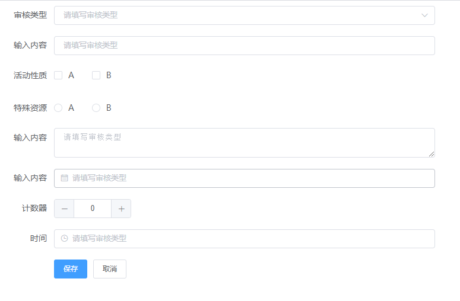

# dynamic-form

> A Vue.js project

# install dependencies
<<<<<<< HEAD
npm install lm-dynamic-form
=======
npm install lm-dynamic-form 
>>>>>>> bbcde86231646ae7a3c7283f97c72f6a516caa15

# main.js
import dynamicForm from 'lm-dynamic-form'
Vue.use(dynamicForm);

#Page usage
<<<<<<< HEAD
<lm-dynamic-form :form="form"></lm-dynamic-form>
=======
 <lm-dynamic-form :form="form"></lm-dynamic-form>
>>>>>>> bbcde86231646ae7a3c7283f97c72f6a516caa15

#Parameter configuration

form.formConfig (表单配置对象)
<<<<<<< HEAD

     lableWidth：‘lable的宽度’
     size：‘输入框大小、（medium / small / mini）’
     labelPosition：lable 对齐方式 (left/right)’

form.freedomConfig(表单内容)

=======
 
     lableWidth：‘lable的宽度’
     size：‘输入框大小、（medium / small / mini）’
     labelPosition：lable 对齐方式 (left/right)’
     
form.freedomConfig(表单内容)
         
>>>>>>> bbcde86231646ae7a3c7283f97c72f6a516caa15
          "name": str,
          "isRules":Boolean,
          "type": "el_select",（el_ 表单的类型）
          "title": "lable 的名称",
          "prompt_msg": "输入提示内容",
          "selectObj":例如 下拉 内容
<<<<<<< HEAD

          selectObj:Array  {id:'',name:''}

form.methods(返回方法)

    @changegetCommom：val Object (返回的数据)

    @changBtns：如果有按钮 返回的 Object
=======
          
          selectObj:Array  {id:'',name:''}
          


```
>>>>>>> bbcde86231646ae7a3c7283f97c72f6a516caa15

For detailed explanation on how things work, consult the [docs for vue-loader](http://vuejs.github.io/vue-loader).
